<br>

[](https://python.org)
[](https://github.com/saksham10arora-dotcom/gitrade/actions)
[](settle.py)
[](CONTRIBUTING.md)

<!-- TIMESTAMP_START -->
<sub>Last tick: _initializing..._</sub>
<!-- TIMESTAMP_END -->

---

## Quick Start

**Trade in 30 seconds** -- open a GitHub Issue with this title:

```
BUY $STAR 10 @ 45
```

That's it. CI picks it up within 15 min, matches it against the book, closes the issue.

**Submit a bot** -- add `bots/yourname.py` with a `decide(market)` function and open a PR. Your bot runs every 15 min, competes in the bot league, earns bragging rights on Sunday.

---

## How It Works

```
  Monday                                          Sunday 00:00 UTC
     |                                                    |
     v                                                    v

  GitHub Issue                                   settle.py runs
  "BUY $STAR 10 @ 45"                           real stats pulled
        |                                        all positions cash-settle
        v                                        champions posted as Issue
  market.py (every 15 min)                      accounts reset to $10,000
        |                                                |
        +-- parse issue                                  |
        +-- run bots (decide())           <--------------+
        +-- match orders (price-time FIFO)     new week begins
        +-- update state.json
        +-- rewrite README
        +-- push [skip ci]
```

No server. No database. `state.json` is the order book. GitHub Actions is the exchange.

---

## Market

<!-- STATS_START -->
| Ticker | Underlying | Fair Value | Last Price |
|--------|-----------|------------|------------|
| `$STAR` | stargazers at settlement | 0 | -- |
| `$COMMIT` | commits this week | 0 | -- |
| `$FORK` | forks at settlement | 0 | -- |
<!-- STATS_END -->

<!-- COUNTDOWN_START -->
**Settlement in: calculating...**
<!-- COUNTDOWN_END -->

---

## Order Book

<!-- BOOK_START -->
_No open orders._
<!-- BOOK_END -->

---

## Trade

Open a GitHub Issue. The title is the order.

<table>
<tr>
<td><strong>Limit</strong></td>
<td><kbd>BUY $STAR 10 @ 45</kbd> &nbsp; <kbd>SELL $COMMIT 5 @ 12</kbd></td>
</tr>
<tr>
<td><strong>Market</strong></td>
<td><kbd>MARKET BUY $FORK 3</kbd></td>
</tr>
<tr>
<td><strong>Cancel</strong></td>
<td><kbd>CANCEL $STAR</kbd></td>
</tr>
</table>

Every account starts at **$10,000**. Shorts work: `SELL` without a position opens a short. If the real stat lands below your price on Sunday, you profit.

---

## Leaderboards

### Human League

<!-- HUMAN_BOARD_START -->
_No participants yet._
<!-- HUMAN_BOARD_END -->

### Bot League

Submit `bots/yourname.py` via PR. One function.

```python
NAME = "yourname"

def decide(market: dict) -> list:
    # called every tick with a live market snapshot:
    # tickers[t]: fair_value, best_bid, best_ask, last_price, price_history[-50]
    # my_cash, my_positions {STAR/COMMIT/FORK}, settles_in_sec
    return [
        {"ticker": "STAR", "side": "BUY", "qty": 5, "price": 45.0},
    ]
```

**Rules:** 2s sandbox timeout, 6 orders/tick, no network calls.
See [`bots/example_meanrev.py`](bots/example_meanrev.py) and [`CONTRIBUTING.md`](CONTRIBUTING.md).

<!-- BOT_BOARD_START -->
_No bots yet._
<!-- BOT_BOARD_END -->

---

## Settlement

```
Every Sunday 00:00 UTC
  1. pull real GitHub stats (stars / commits-this-week / forks)
  2. cash-settle all positions:  pnl = (settlement_price - entry_price) * qty
  3. post champion Issue
  4. reset all accounts to $10,000
```

The market price is where people think the numbers land. Settlement is where they actually land.

---

## Hall of Fame

<!-- HALLOFFAME_START -->
_No champions yet. First settlement is Sunday._
<!-- HALLOFFAME_END -->

---

<details>
<summary><strong>Architecture</strong></summary>

<br>

```
gitrade/
├── engine.py           matching, P&L, settlement  (pure logic, zero I/O)
├── market.py           15-min tick orchestrator
├── settle.py           Sunday 00:00 UTC cron
├── render.py           state -> README marker sections
├── charts.py           neon SVG charts -> assets/
├── github_stats.py     GitHub API wrapper (never raises)
│
├── bots/
│   ├── loader.py           discover + sandbox (SIGALRM 2s)
│   ├── _mm.py              market maker  (+/- 4% spread)
│   ├── _noise.py           noise trader
│   ├── _momentum.py        trend follower (LOOKBACK=4)
│   └── example_meanrev.py  contributor baseline
│
├── tools/
│   └── simulate.py         local tester (no token needed)
│                           python3 tools/simulate.py 50
│
└── .github/workflows/
    ├── market.yml          cron: */15 * * * *
    └── settle.yml          cron: 0 0 * * 0
```

**State shape:**
```json
{
  "week_number": 1,
  "fair_value":  { "STAR": 0, "COMMIT": 0, "FORK": 0 },
  "books":       { "STAR": { "bids": [], "asks": [] } },
  "accounts":    { "user": { "cash": 10000, "positions": {} } },
  "price_history": { "STAR": [44, 45, 46] },
  "hall_of_fame": []
}
```

</details>

---

<sub>Built by <a href="https://github.com/saksham10arora-dotcom">@saksham10arora-dotcom</a></sub>
